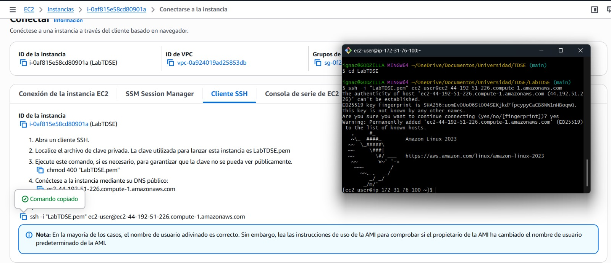
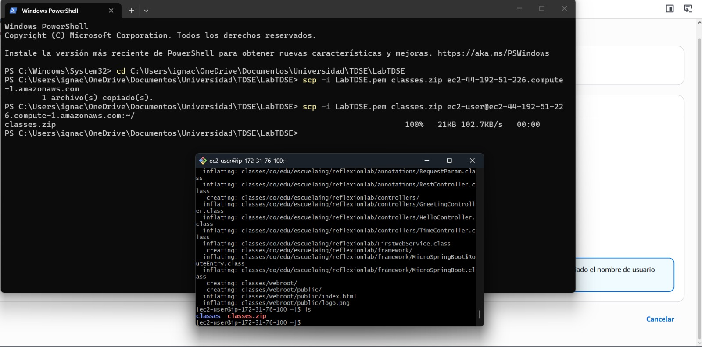
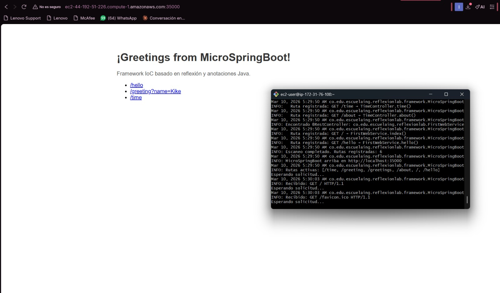
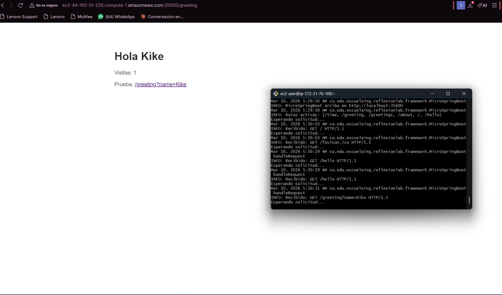
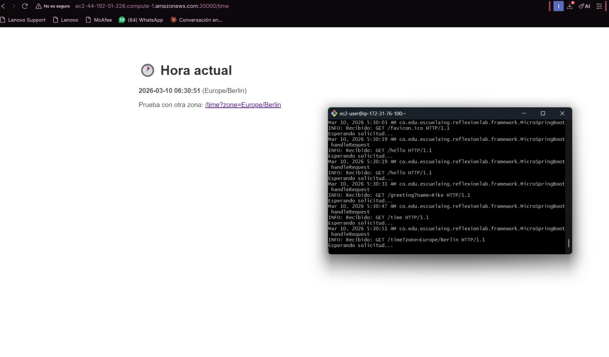

# LabTDSE-Servidores

### Explicación desarrollo código

### Evidencias conexión con instancia AWS
1. Conexión con la instancia por SSH

2. Pasar el zip de las clases compiladas por SSH

3. Pruebas

